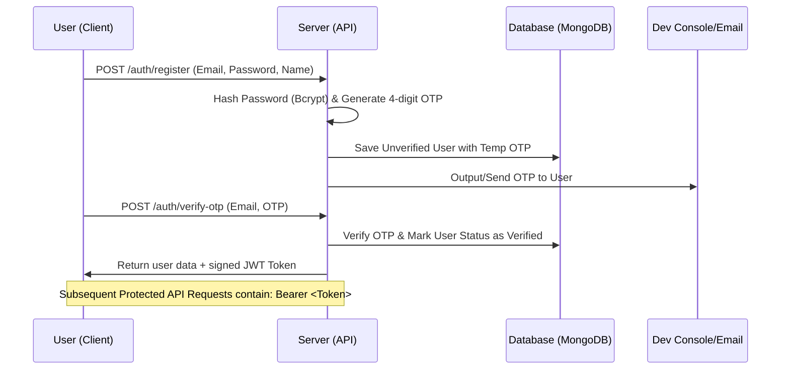
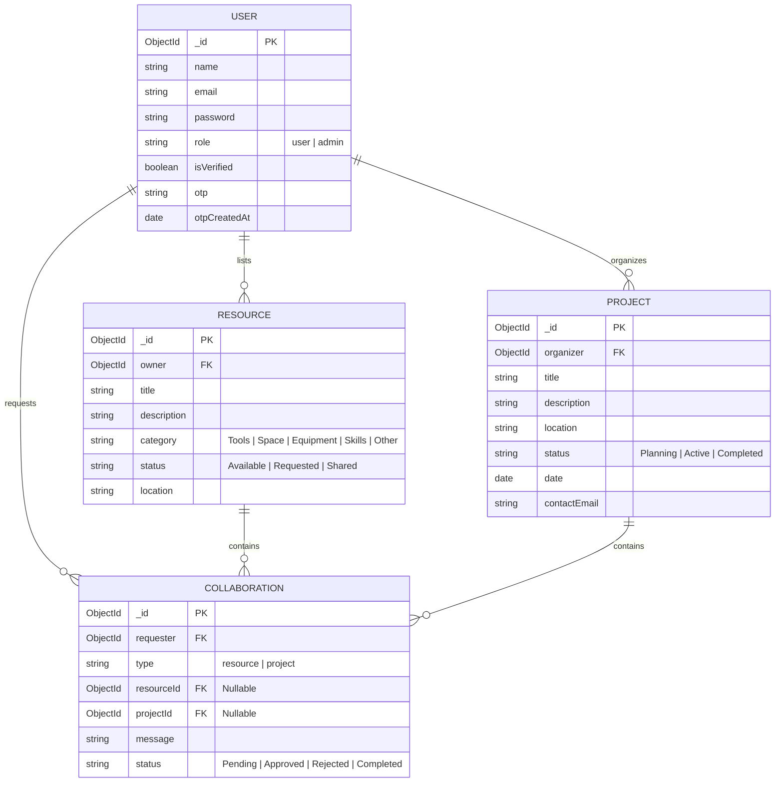

# 🌟 EKYAM — Community Collaboration & Resource Sharing Platform

EKYAM is a comprehensive, production-ready full-stack platform designed to foster community resilience, collaboration, and mutual aid. It enables citizens to share physical resources (e.g., tools, equipment, spaces), organize local community initiatives, form volunteer projects, and coordinate request-response collaborations through a unified dashboard.

---

## 📖 Table of Contents

- [✨ Key Features](#-key-features)
- [💻 Tech Stack](#-tech-stack)
- [📂 Codebase Structure](#-codebase-structure)
- [🚀 Getting Started](#-getting-started)
  - [Prerequisites](#prerequisites)
  - [1. Clone & Setup](#1-clone--setup)
  - [2. Environment Configuration](#2-environment-configuration)
  - [3. Database Seeding](#3-database-seeding)
  - [4. Running locally](#4-running-locally)
- [🔒 Authentication & Security Flow](#-authentication--security-flow)
- [🗄️ Database Schema & Relationships](#️-database-schema--relationships)
- [📡 API Route Reference](#-api-route-reference)
- [🌐 Deployment Guide](#-deployment-guide)
  - [Backend (Render)](#backend-render)
  - [Frontend (Vercel)](#frontend-vercel)
- [🛠️ Development & Troubleshooting](#️-development--troubleshooting)
- [📄 License](#-license)

---

## ✨ Key Features

### 👤 User Management & Secure Auth
- **OTP Verification Flow**: Email sign-up starts a verification step using OTP (One-Time Password) logged securely in dev mode or delivered via email services in production.
- **JWT Session Management**: Stateful security via JSON Web Tokens for client-side storage and backend verification.
- **Profile Customization**: Users can edit profiles directly in their personal settings.

### 📦 Resource Sharing Marketplace
- **Resource Listings**: List items (tools, books, equipment) or spaces (gardens, rooms) with descriptive titles, descriptions, categories, and availability status.
- **Request Workflows**: Members can request access to or reservation of listed resources.

### 🤝 Project & Initiatives Organizer
- **Community Projects**: Post new community initiatives (e.g., neighborhood clean-ups, charity drives) with timelines, organizer contact details, and location details.
- **Request to Join**: Community members can submit request forms to join active projects.

### 📊 Collaboration & Request Dashboard
- **Request Management**: A unified center to review all outbound requests (resources requested, projects joined) and inbound requests (requests on resources you own, or requests to join your projects).
- **Interactions**: Approve, reject, or complete requests in real time.

### 🛡️ Admin Panel & Analytics
- **Global Overview**: Track database stats (number of users, resources, projects, and active collaborations).
- **Content Auditing & Moderation**: Admin dashboard to delete users, resources, or projects that violate community guidelines.

---

## 💻 Tech Stack

### Frontend Architecture
- **React 18**: Dynamic interface build using functional components and hooks.
- **React Router Dom (v6)**: Single Page Application (SPA) client routing with protected route guards.
- **Vite**: Ultra-fast hot-module-replacement (HMR) bundler.
- **Vanilla CSS**: Standard stylesheet design with custom variables, layout systems (Flexbox, Grid), responsive grid structures, and interactive states.

### Backend & API Architecture
- **Node.js & Express**: Modular routing pattern with controllers, middleware, and schema validation.
- **Mongoose / MongoDB**: ODM integration supporting document schemas, relational references, virtual fields, and index optimization.
- **Bcrypt.js & JWT**: Cryptographic hashing and token validation.

---

## 📂 Codebase Structure

```text
EKYAM-main/
│
├── client/                      # Frontend Application (React & Vite)
│   ├── public/                  # Static assets (favicons, public graphics)
│   ├── src/
│   │   ├── api/                 # API connection configurations
│   │   │   └── client.js        # Axios instance / Fetch wrapper config
│   │   ├── components/          # Shared components
│   │   │   ├── Layout.jsx       # Persistent header, footer, & outlet layout
│   │   │   ├── Navbar.jsx       # Responsive navigation with auth links
│   │   │   └── ProtectedRoute.jsx # Wrapper to restrict routes to auth/admin users
│   │   ├── context/             # Global Context providers
│   │   │   └── AuthContext.jsx  # Authentication state (user, token, login/logout)
│   │   ├── pages/               # Routing View Components
│   │   │   ├── Admin.jsx        # Admin Dashboard for user & content oversight
│   │   │   ├── Communities.jsx  # View listings of active local communities
│   │   │   ├── CreateProject.jsx# Form to initialize community initiatives
│   │   │   ├── CreateResource.jsx# Form to publish resource listings
│   │   │   ├── Dashboard.jsx    # User Panel (tracks resources, joins, requests)
│   │   │   ├── Home.jsx         # Landing page with stats & call-to-actions
│   │   │   ├── Login.jsx        # Credentials login panel
│   │   │   ├── ProjectDetail.jsx# Full details page for projects
│   │   │   ├── Projects.jsx     # Directory of all community projects
│   │   │   ├── Register.jsx     # Registration panel
│   │   │   ├── ResourceDetail.jsx# Full details page for resources
│   │   │   ├── Resources.jsx    # Marketplace page listing all resources
│   │   │   └── VerifyOtp.jsx    # OTP code insertion step
│   │   ├── App.jsx              # Routing rules & view structures
│   │   ├── index.css            # Modular design system CSS (colors, sizes, components)
│   │   └── main.jsx             # React DOM entrypoint
│   ├── package.json             # Frontend script, dependencies & metadata
│   ├── vercel.json              # Vercel SPA configuration rules
│   └── vite.config.js           # Vite development server and plugin parameters
│
├── server/                      # Backend API Service (Express & Mongoose)
│   ├── config/
│   │   └── db.js                # Database connection utility
│   ├── controllers/             # Express Endpoint Handlers
│   │   ├── adminController.js   # Analytics, User and item deletion
│   │   ├── authController.js    # Register, OTP verify, Login, Profile updates
│   │   ├── collaborationController.js # Handles collaboration status changes
│   │   ├── projectController.js # Project CRUD & join request submissions
│   │   ├── publicController.js  # Stat metrics & featured project listings
│   │   └── resourceController.js# Resource CRUD & request operations
│   ├── middleware/
│   │   └── auth.js              # Authentication verify & admin check middleware
│   ├── models/                  # MongoDB Schema Definitions
│   │   ├── Collaboration.js     # Requests schema (types, status, references)
│   │   ├── Project.js           # Project structures
│   │   ├── Resource.js          # Resource listing structures
│   │   └── User.js              # User profiles, passwords, role tags
│   ├── routes/                  # Express Router Modules
│   │   ├── adminRoutes.js       # Admin secured endpoints
│   │   ├── authRoutes.js        # Auth state endpoints
│   │   ├── collaborationRoutes.js # Collaboration operations
│   │   ├── projectRoutes.js     # Project operations
│   │   ├── publicRoutes.js      # Public landing info
│   │   └── resourceRoutes.js    # Resource marketplace operations
│   ├── scripts/
│   │   └── seedAdmin.js         # Default database Admin account seeder
│   ├── utils/
│   │   └── email.js             # Mail utilities (dev console log or API keys)
│   ├── index.js                 # App server startup and middleware settings
│   └── package.json             # Server script, dependencies & metadata
│
├── render.yaml                  # Render Platform-as-a-Service deployment template
└── README.md                    # System Documentation (this file)
```

---

## 🚀 Getting Started

### Prerequisites
- **Node.js**: `v18.x` or newer (Recommended: `v22.x` for server)
- **MongoDB**: A running local instance or a MongoDB Atlas Cloud URI.
- **npm**: Package Manager.

---

### 1. Clone & Setup

Download the repository and install all dependencies for both the **Frontend Client** and **Backend Server**.

```bash
# Clone the repository
git clone <repository-url>
cd EKYAM-main

# Install Server dependencies
cd server
npm install

# Install Client dependencies
cd ../client
npm install
```

---

### 2. Environment Configuration

You will need to set up environment variable files (`.env`) in both directories.

#### Backend Setup (`server/.env`)
Create a new file called `.env` in the `server` directory:

```env
# Application Port
PORT=5000

# MongoDB Connection String
MONGODB_URI=mongodb://127.0.0.1:27017/ekyam

# Secret used to encrypt and verify JWT Auth Tokens (Make it long & random)
JWT_SECRET=super_secret_session_token_key_change_me

# Allowed Frontend URL (CORS verification)
CLIENT_URL=http://localhost:3000

# Optional Mail Service setup (Leave blank to output OTP to console)
MAILTRAP_TOKEN=your_mailtrap_token_here
```

#### Frontend Setup (`client/.env`)
Create a new file called `.env` in the `client` directory:

```env
# Endpoint of the REST API (Make sure it has the /api suffix)
VITE_API_URL=http://localhost:5000/api
```

---

### 3. Database Seeding

To access protected admin areas, populate your database with a default Admin user. Run this inside the `server/` directory:

```bash
cd server
npm run seed
```

Once executed successfully, you can log in using:
* **Email:** `admin@ekyam.com`
* **Password:** `admin123`

> [!WARNING]
> Remember to modify or delete this seeded user before taking the app live in a public server context.

---

### 4. Running locally

Start both parts in separate terminals to run your local copy:

#### Terminal 1: Backend
```bash
cd server
npm run dev
```

#### Terminal 2: Frontend
```bash
cd client
npm run dev
```

* **Frontend Server:** [http://localhost:3000](http://localhost:3000)
* **API Server Health Check:** [http://localhost:5000/api/health](http://localhost:5000/api/health)

---

## 🔒 Authentication & Security Flow

Ekyam implements an authorization gate using **One-Time Passwords (OTP)** and **JWT Tokens**.



> [!NOTE]
> During development, to make registration quick, the OTP is printed directly in the **Server Terminal Console**. Simply copy it from your running backend log and input it into the web form.

---

## 🗄️ Database Schema & Relationships



---

## 📡 API Route Reference

### 🌐 Public & Authentication Endpoints
| HTTP Method | Route URL | Description | Auth Required |
| :--- | :--- | :--- | :--- |
| `GET` | `/api/health` | Service status healthcheck | No |
| `GET` | `/api/public/stats` | Retrieve user, project & resource numbers | No |
| `GET` | `/api/public/communities` | Retrieve community distribution information | No |
| `GET` | `/api/public/featured-projects` | Obtain list of highlighted projects | No |
| `POST` | `/api/auth/register` | Register new profile & generate activation OTP | No |
| `POST` | `/api/auth/verify-otp` | Submit verification code to receive JWT token | No |
| `POST` | `/api/auth/login` | Check credentials & sign new JWT token | No |
| `GET` | `/api/auth/me` | Fetch active user credentials from session | **Yes** |
| `PUT` | `/api/auth/profile` | Update account details | **Yes** |

### 🛠️ Resource Marketplace Endpoints
| HTTP Method | Route URL | Description | Auth Required |
| :--- | :--- | :--- | :--- |
| `GET` | `/api/resources` | Fetch all active resource listings | No |
| `GET` | `/api/resources/:id` | Fetch specific details of a resource | No |
| `POST` | `/api/resources` | Publish a new resource item to the marketplace | **Yes** |
| `PUT` | `/api/resources/:id` | Update resource listings details (Only Owner) | **Yes** |
| `DELETE` | `/api/resources/:id` | Delete resource listing (Owner or Admin) | **Yes** |
| `POST` | `/api/resources/:id/request` | Submit a request for borrowing or sharing | **Yes** |

### 🌿 Community Project Endpoints
| HTTP Method | Route URL | Description | Auth Required |
| :--- | :--- | :--- | :--- |
| `GET` | `/api/projects` | Fetch list of community initiatives | No |
| `GET` | `/api/projects/:id` | Get individual project details | No |
| `POST` | `/api/projects` | Publish a new community project | **Yes** |
| `PUT` | `/api/projects/:id` | Modify project settings (Only Organizer) | **Yes** |
| `DELETE` | `/api/projects/:id` | Delete project listing (Organizer or Admin) | **Yes** |
| `POST` | `/api/projects/:id/join` | Submit a request to participate/volunteer | **Yes** |

### 🤝 Collaboration Management Endpoints
| HTTP Method | Route URL | Description | Auth Required |
| :--- | :--- | :--- | :--- |
| `GET` | `/api/collaborations/mine` | Load all outbound and inbound request listings | **Yes** |
| `PATCH` | `/api/collaborations/:id` | Approve, reject, or mark requests as complete | **Yes** |

### 👑 Admin Moderation & Stats Endpoints
| HTTP Method | Route URL | Description | Role Required |
| :--- | :--- | :--- | :--- |
| `GET` | `/api/admin/stats` | Load admin-level server analytics dashboard | **Admin** |
| `GET` | `/api/admin/users` | List all registered user database entries | **Admin** |
| `DELETE` | `/api/admin/users/:id`| Revoke account & delete user from DB | **Admin** |
| `GET` | `/api/admin/resources` | List all resources with deletion access | **Admin** |
| `GET` | `/api/admin/projects` | List all projects with deletion access | **Admin** |

---

## 🌐 Deployment Guide

### Backend (Render)
Ekyam contains a pre-configured `render.yaml` infrastructure template, simplifying backend hosting.

1. Create an account on **[Render](https://render.com/)**.
2. Connect your GitHub repository.
3. Import the configuration utilizing the **Blueprint** feature, or create a Web Service using these manual settings:
   - **Root Directory**: `server`
   - **Build Command**: `npm install`
   - **Start Command**: `npm start`
   - **Node.js Version**: Environment variable `NODE_VERSION=22`
4. Supply your `.env` variables inside the service configuration menu:
   - `MONGODB_URI` *(Remote MongoDB Atlas Connection String)*
   - `JWT_SECRET` *(Unique secret string)*
   - `CLIENT_URL` *(Your final deployed frontend domain, e.g., `https://ekyam-platform.vercel.app`)*

---

### Frontend (Vercel)
Deploy your user client on **[Vercel](https://vercel.com/)** for fast global hosting:

1. Create or log in to your Vercel account.
2. Select **Add New Project** and connect your repository.
3. Configure the following parameters:
   - **Framework Preset**: `Vite`
   - **Root Directory**: `client`
   - **Build Command**: `npm run build`
   - **Output Directory**: `dist`
4. Set the environment variable:
   - `VITE_API_URL` = `https://your-backend-service-domain.onrender.com/api`
5. Click **Deploy**. Update the backend's `CLIENT_URL` variable to this domain once live.

---

## 🛠️ Development & Troubleshooting

### Port is Already in Use
If you launch the backend and get an `EADDRINUSE` error on port `5000`:
* On **Windows**:
  ```powershell
  # Find what program has the port locked
  netstat -ano | findstr :5000
  # Terminate the program using its PID
  taskkill /PID <PID_NUMBER> /F
  ```
* On **macOS/Linux**:
  ```bash
  lsof -i :5000
  kill -9 <PID_NUMBER>
  ```
* Alternatively, configure a different port in `server/.env` (e.g. `PORT=5001`), and update `client/.env`'s `VITE_API_URL` to match.

### CORS Errors on Request Submission
Ensure that:
1. `CLIENT_URL` in `server/.env` matches the frontend's origin URL exactly, without trailing slashes (e.g., `http://localhost:3000`).
2. The browser is not caching old preflight CORS requests.

### OTP Email delivery failure
In development, OTP delivery uses console logging by default. Make sure to check the server terminal to copy-paste verification keys. Real email transmission requires a valid Mailtrap token.

---

## 📄 License

This project is licensed under the MIT License - see the LICENSE file for details.